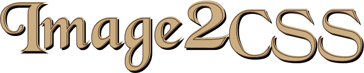
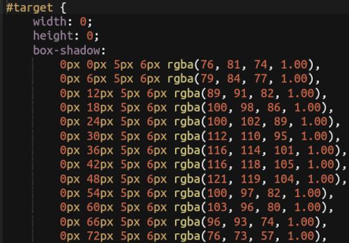
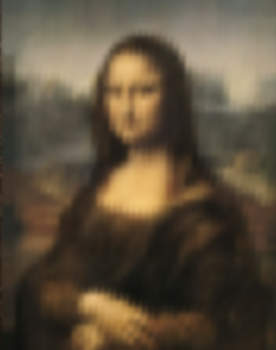

<!-- README template from https://github.com/dthung1602/image2css -->


[![Contributors][contributors-shield]][contributors-url]
[![Forks][forks-shield]][forks-url]
[![Stargazers][stars-shield]][stars-url]
[![Issues][issues-shield]][issues-url]
[![WTFPL License][license-shield]][license-url]

<!-- PROJECT LOGO -->
<br />
<p align="center">
    
    <br/>
    <small><i>Convert image to pure CSS art with box shadow</i></small>
    <br/>
    <a href="https://dthung1602.github.io/image2css" target="_blank"><b>Try in browser</b></a>
</p>

<p align="center">
    
    
</p>

<!-- GETTING STARTED -->

## Getting Started

Use as CLI:

```bash
make build_cli
./image2css --input path/to/image --output output/css/file
```

Options:
```
-i, --input       Path to input image. Only support PNG, JPG and GIF
-o, --output      Path ot output CSS file. Default: path/to/input/image/image-name.css
-s, --selector    CSS selector to render CSS. Default: #target
-w, --width       Target image width. Default: input image width
-h, --height      Target image height. Default: input image height
-r, --resolution  Size (in px) of one shadow box. 1 = best resolution. Default: 5
```

> Note: try to keep the number of shadows less than 10000 
> 
> Browser might freeze if there are more
> 
> `shadows number = width * height / (resolution ** 2)`

Use as WASM module:

```
make build_wasm
open docs/index.html
```

Use as a Go package:

```bash
go get github.com/dthung1602/image2css
```

```go
package main

import (
    "image"
    "github.com/dthung1602/image2css/image2css"
)


func main() {
    img := // read image from somewhere
    img = image2css.ScaleImage(img, width, height) // Rescale the image if you like

    resolution = 4
    cssSelector = "#my-image"
    css := image2css.GenCSS(img, resolution, cssSelector)
    // do something with the css string
}

```


<!-- LICENSE -->
## License

Distributed under the WTFPL License.

**You just DO WHAT THE F*CK YOU WANT TO**


<!-- CONTRIBUTING -->
## Contributing

Any contributions you make are greatly appreciated.

1. Fork the Project
2. Create your Feature Branch (`git checkout -b feature/AmazingFeature`)
3. Commit your Changes (`git commit -m 'Add some AmazingFeature'`)
4. Push to the Branch (`git push origin feature/AmazingFeature`)
5. Open a Pull Request


<!-- CONTACT -->
## Contact

Duong Thanh Hung - [dthung1602@gmail.com](mailto:dthung1602@gmail.com)

Project Link: [https://github.com/dthung1602/image2css](https://github.com/dthung1602/image2css)


<!-- ACKNOWLEDGEMENTS -->
## Acknowledgements
* [Original PHP implementation](https://github.com/jaysalvat/image2css)
* [Black chancery font](https://www.freefontspro.com/14296/black-chancery.ttf)
* [Font awesome](https://fontawesome.com/icons)
* [Ace editor](https://ace.c9.io/)
* [Img Shields](https://shields.io)
* [Best README template](https://github.com/othneildrew/Best-README-Template)


<!-- MARKDOWN LINKS & IMAGES -->
<!-- https://www.markdownguide.org/basic-syntax/#reference-style-links -->
[contributors-shield]: https://img.shields.io/github/contributors/dthung1602/image2css.svg?style=flat-square
[contributors-url]: https://github.com/dthung1602/image2css/graphs/contributors
[forks-shield]: https://img.shields.io/github/forks/dthung1602/image2css.svg?style=flat-square
[forks-url]: https://github.com/dthung1602/image2css/network/members
[stars-shield]: https://img.shields.io/github/stars/dthung1602/image2css.svg?style=flat-square
[stars-url]: https://github.com/dthung1602/image2css/stargazers
[issues-shield]: https://img.shields.io/github/issues/dthung1602/image2css.svg?style=flat-square
[issues-url]: https://github.com/dthung1602/image2css/issues
[license-shield]: https://img.shields.io/github/license/dthung1602/image2css.svg?style=flat-square
[license-url]: https://github.com/dthung1602/image2css/blob/master/LICENSE
